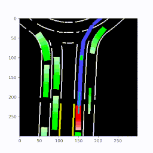

# gym-carla
An [OpenAI gym third party environment](https://github.com/openai/gym/blob/master/docs/environments.md) for [CARLA simulator](http://carla.org/).

## System Requirements
- Ubuntu 16.04

## Installation
1. Setup conda environment
```
$ conda create -n env_name python=3.6
$ conda activate env_name
```

2. Clone this git repo in an appropriate folder
```
$ git clone https://github.com/cjy1992/gym-carla.git
```

3. Enter the repo root folder and install the packages:
```
$ pip install -r requirements.txt
$ pip install -e .
```

4. Download [CARLA_0.9.6](https://github.com/carla-simulator/carla/releases/tag/0.9.6), extract it to some folder, and add CARLA to ```PYTHONPATH``` environment variable:
```
$ export PYTHONPATH=$PYTHONPATH:$YourFolder$/CARLA_0.9.6/PythonAPI/carla/dist/carla-0.9.6-py3.5-linux-x86_64.egg
```

## Usage
1. Enter the CARLA root folder and launch the CARLA server by:
```
$ ./CarlaUE4.sh -windowed -carla-port=2000
```
You can use ```Alt+F1``` to get back your mouse control.

Or you can run in non-display mode by:
```
$ DISPLAY= ./CarlaUE4.sh -opengl -carla-port=2000
```

2. Run the test file:
```
$ python test.py
```
See details of ```test.py``` about how to use the CARLA gym wrapper.

## Description
1.  We provide a dictionary observation including front view camera (obs['camera']), birdeye view lidar point cloud (obs['lidar']) and birdeye view semantic representation (obs['birdeye']):
<div align="center">
  
</div>
We also provide a state vector observation (obs['state']) which is composed of lateral distance and heading error between the ego vehicle to the target lane center line (in meter and rad), ego vehicle's speed (in meters per second), and and indicator of whether there is a front vehicle within a safety margin.

2. The termination condition is either the ego vehicle collides, runs out of lane, reaches a destination, or reaches the maximum episode timesteps. Users may modify function _terminal in carla_env.py to enable customized termination condition.

3. The reward is a weighted combination of longitudinal speed and penalties for collision, exceeding maximum speed, out of lane, large steering and large lateral accleration. Users may modify function _get_reward in carla_env.py to enable customized reward function.

## Related Repos and Papers
### Deep Reinforcement Learning for Autonomous Driving
- See [https://github.com/cjy1992/interp-e2e-driving](https://github.com/cjy1992/interp-e2e-driving), which provides implementations for the paper [Interpretable End-to-end Urban Autonomous Driving with Latent Deep Reinforcement Learning](https://arxiv.org/abs/2001.08726) and paper [Model-free Deep Reinforcement Learning for Urban Autonomous Driving](https://ieeexplore.ieee.org/abstract/document/8917306), as well as several deep RL baselines for autonomous driving on CARLA.
<div align="center">
  
</div>

### Deep Imitation Learning for Autonomous Driving
- See paper [Deep Imitation Learning for Autonomous Driving in Generic Urban Scenarios with Enhanced Safety](https://arxiv.org/abs/1903.00640).
<div align="center">
  
  
</div>

### Autonomous Driving Perception and Representation Learning
- See [https://github.com/cjy1992/detect-loc-map](https://github.com/cjy1992/detect-loc-map), which provides implementations for the paper [End-to-end Autonomous Driving Perception with Sequential Latent Representation Learning](https://arxiv.org/abs/2003.12464).
<div align="center">
  
</div>


